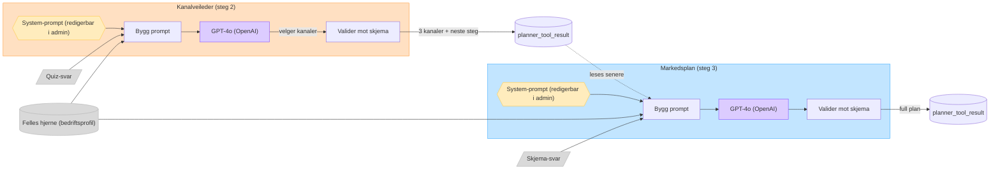

# On Poynt — slik fungerer AI-verktøyene

Dette dokumentet forklarer hvordan verktøyene i On Poynt faktisk kjører under
panseret — hva som mater dem, hvilken modell de bruker, hvor «logikken» bor, og
hvordan de henger sammen. Skrevet fordi flyten er AI-generert og det er lett å
miste oversikten.

## Kortversjonen

- Alle flaggskip-verktøyene (**Kanalveileder**, **Markedsplan**, **Årshjul**)
  sender en prompt til **OpenAI `gpt-4o`** og får strukturert JSON tilbake.
  Det er **AI-en som tar avgjørelsene** — det finnes ingen scoring-algoritme i
  koden som velger kanaler. Modellen er satt ÉTT sted:
  [`packages/planner-api/lib/models.ts`](../packages/planner-api/lib/models.ts).
- «Reglene» (f.eks. *B2B → LinkedIn veier tungt*, *lite tid → nedprioriter
  YouTube*) er **instrukser skrevet i system-prompten**, ikke kode.
- System-promptene ligger i databasen og er **redigerbare i admin** under
  **On Poynt → Prompt-maler**. Koden har en hardkodet fallback hvis DB-raden
  mangler ([`prompt-template.ts`](../packages/planner-api/lib/prompt-template.ts)).
- Det er **ÉN prompt per verktøy — ikke én per bransje.** Bransjen limes inn
  som tekst i prompten; den styrer ikke hvilken mal som brukes. (Infrastrukturen
  støtter `{{variabler}}`, så per-bransje-vri *kunne* legges til, men finnes
  ikke i dag.)
- Hvert resultat lagres i tabellen `planner_tool_result` (Drizzle, `planner`-
  skjema), og kan leses av andre verktøy senere — det er slik **Markedsplanen nå
  bygger på Kanalveilederens valgte kanaler**.

## Dataflyt: Kanalveileder → Markedsplan

## «Felles hjerne» — den delte konteksten

Alle verktøyene beriker prompten med den samme bedriftsprofilen, slik at de
deler én forståelse av bedriften. Bygges i
[`profile-context.ts`](../packages/planner-api/lib/profile-context.ts):

- **Bedriftsprofil**: størrelse, målgruppetype, målgruppe-beskrivelse, mål,
  ekstra kontekst.
- **Merkevarebrief**: tone of voice, kjernebudskap, USP, målgruppe-innsikt,
  setninger de bruker / aldri ville brukt, visuell stil.
- **Merkevare-identitet**: tagline, farger, fonter.

Profilen hentes for det **aktive arbeidsområdet** (`getActiveWorkspaceId`).
Mangler den, faller verktøyet pent tilbake til kun skjema-svarene.

## Verktøy for verktøy

| Verktøy | Modell | Input | System-prompt (admin-id) | Output → |
|---|---|---|---|---|
| **Kanalveileder** | `gpt-4o` | Quiz (bransje, målgruppe, mål, tid/uke, styrker, tidl. kanaler) + felles hjerne | `channel-guide-system` | 3 kanaler m/ matchnivå, begrunnelse, «neste steg» → `planner_tool_result` |
| **Markedsplan** | `gpt-4o` | Skjema (bransje, størrelse, mål, tidsramme, budsjett …) + felles hjerne **+ Kanalveilederens kanaler** | `marketing-plan-system` (variabel `{{channelCount}}`) | Full plan: kanaler, tidslinje, ukerytme, quick wins → `planner_tool_result` |
| **Årshjul** | `gpt-4o` | Skjema + felles hjerne | `yearly-planner-system` (`{{currentYear}}`, `{{currentMonthName}}`) | 12-mnd innholdsplan m/ temaer, merkedager |
| **Avslå-generator** | `gpt-4o-mini` | Situasjon / innlimt melding | `decline-generator-system` / `-analysis` | 3 ferdige svar-varianter |

Kilde for promptene og fallback-teksten:
[`prompt-template.ts`](../packages/planner-api/lib/prompt-template.ts).
Seeding til DB: [`apps/web/scripts/seed-prompts.ts`](../apps/web/scripts/seed-prompts.ts).

## Hvordan ett kall kjører (Kanalveileder, konkret)

1. Brukeren fyller quizen. Bransje sendes som **id**; navnet slås opp fra
   `planner_industry`.
2. Skjemasvar oversettes til norske etiketter (rene oppslag, ingen AI).
3. **Felles hjerne** hentes via `getWorkspaceProfileBlock`.
4. System-prompten hentes fra DB via `resolveSystemPrompt("channel-guide-system")`
   (fallback til koden hvis ingen aktiv rad).
5. Bruker-prompt + system-prompt sendes til `gpt-4o` med
   `streamText` + `Output.object` — svaret **valideres mot et zod-skjema** så
   det alltid blir nøyaktig 3 kanaler.
6. Resultatet streames til UI-et og lagres i `planner_tool_result`
   (`toolId = "channel-guide"`).
7. Neste gang **Markedsplanen** kjøres, leser den siste `channel-guide`-rad og
   ber modellen *bygge planen på disse kanalene*
   (`getChannelGuideBlock` i `profile-context.ts`).

## Vil du tweake oppførselen?

- **Endre tonen / reglene for et verktøy:** rediger system-prompten i
  **On Poynt → Prompt-maler**. Ingen kodeendring, ingen deploy.
- **Bytte AI-modell (f.eks. til Claude):** én linje i
  [`models.ts`](../packages/planner-api/lib/models.ts).
- **Per-bransje-prompt:** ikke bygget i dag. Ville krevd enten egne maler per
  bransje eller bransje-spesifikke `{{variabler}}` matet inn i den felles
  prompten.
